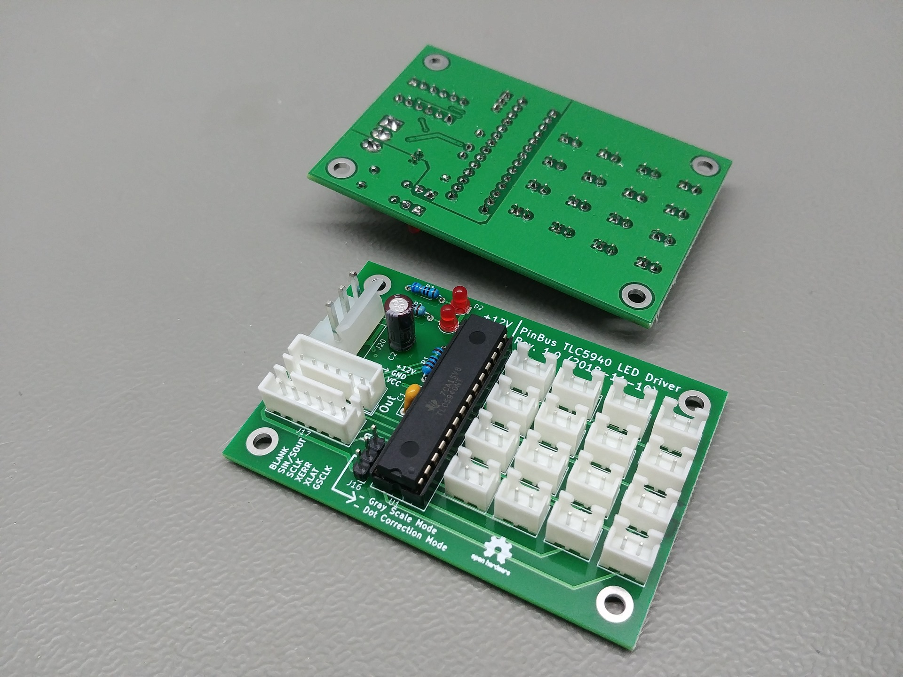
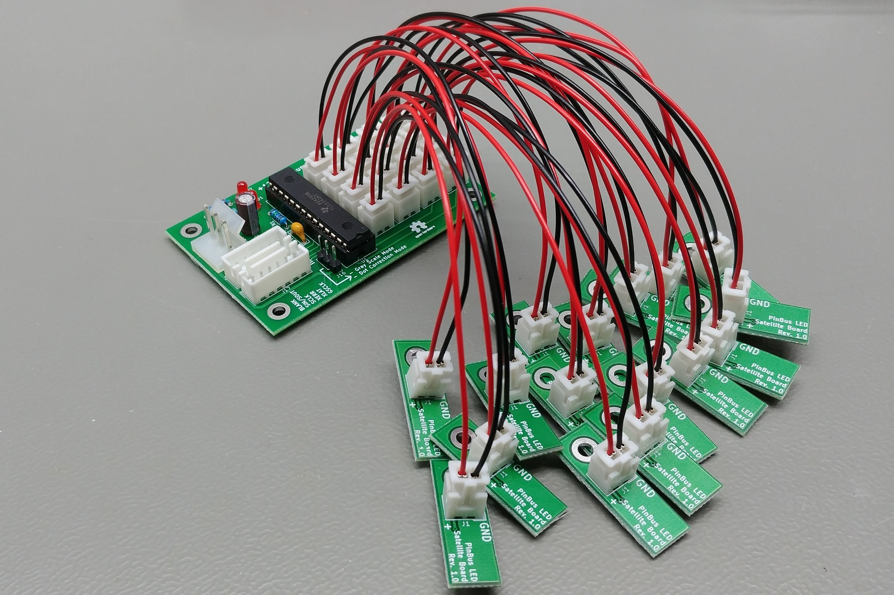
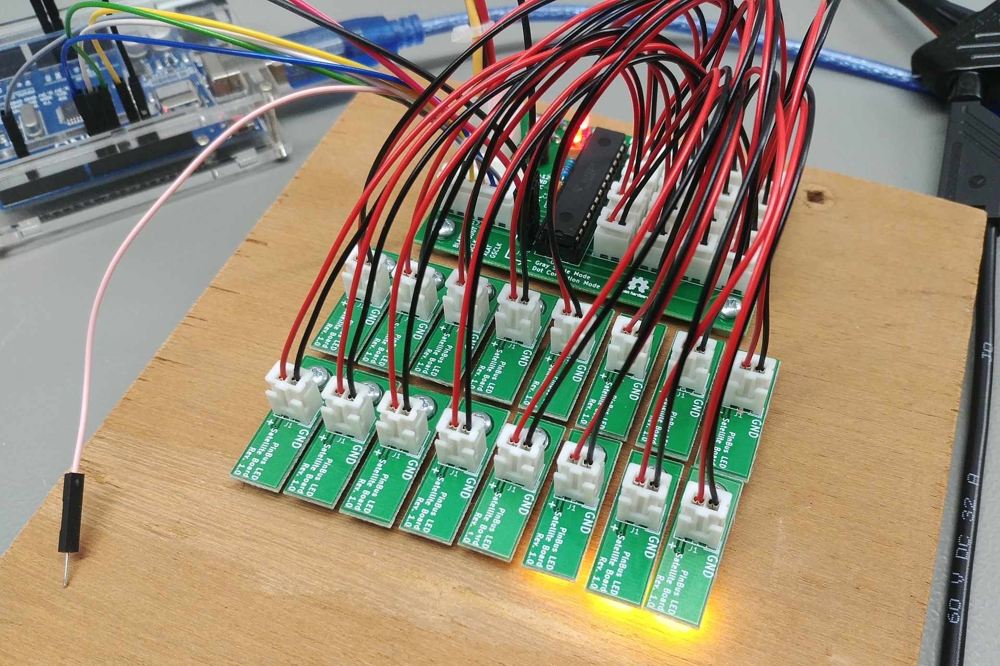

# TLC5940 LED Driver Board - Rev. 1.0

This is a board designed for a TLC5940 LED driver IC. Each of the TLC5940's outputs has a separate connector. It can be used with the [1206 LED Satellite Board](https://github.com/PinBus/1206_LED_satellite_board).

The values of the parts listed in the BOM are chosen based on VCC = +5V, VO = +12V, and IOLC = 30mA. If you want another value for IOLC, change the value of resistor R1 using the formula given on page 17 of the [datasheet](assets/tlc5940.pdf).

When using another voltage for VCC or when using another colour of LED, remember to change the value of R2. Whe using another voltage for VO or using another colour of LED, remember to change the value of R3.

**Warning: These designs are made as part of a hobby project and thus come with no guarantees. Do not use these designs in for any critical systems! Working with voltages higher than +40V can be potentially dangerous, please take appropriate safety measures!**

## BOM

| Identifiers | Quantity | Part |
| ----------- | -------- | ---- |
| C1          |       1x | 100nF Ceramic capacitor, 5mm pin pitch |
| C2          |       1x | 1μF Electrolytic capacitor, 2mm pin pitch, 5mm diameter |
| D1, D2      |       2x | 3mm red LED |
| J0 - J15    |      16x | JST XH connector, 2.5mm pitch, 2-way, through-hole |
| J16         |       1x | Dupont male connector, 2.54mm pitch, 3-way, through-hole |
|             |       1x | Jumper (for the dupont connector) |
| J17, J18    |       2x | JST XH connector, 2.5mm pitch, 6-way, through-hole |
| J20         |       1x | CH 3.96 connector, 3-way, through hole |
| R1          |       1x | 1.3KΩ 0.25W resistor |
| R2          |       1x | 180Ω 0.25W resistor |
| R3          |       1x | 560Ω 0.25W resistor |
| U1          |       1x | TLC5940NT LED driver IC |
|             |       1x | Optional: Socket for the TLC5940 |

## Pictures

